# digeHealth bowel sounds

Proof-of-concept model that finds bowel sounds in an audio recording and gives, for each one, its **start time**, **end time** and **type**:

| Label | Sound |
|---|---|
| `sb` | single burst (annotated `b` or `sbs` in the raw files) |
| `mb` | multiple burst |
| `h` | harmonic |

Voice (`v`) and noise (`n`) are in the annotations; the pipeline treats them as background.

```
$ uv run python main.py predict recording.wav
1.665 1.745 sb
2.545 3.205 h
3.505 3.655 mb
...
```

## Contents

- [Usage](#usage)
  - [From nothing to a prediction](#from-nothing-to-a-prediction)
  - [`predict`](#predict-find-the-bowel-sounds-of-a-file)
  - [`train`](#train-train-a-model)
  - [`evaluate`](#evaluate-score-saved-weights)
  - [`pipeline`](#pipeline-score-the-two-stages-together)
  - [Good to know](#good-to-know)
- [Repository layout](#repository-layout)
- [How it works](#how-it-works)
  - [Detector architecture](#detector-architecture)
  - [Prediction flow](#prediction-flow)
  - [Training and scoring flow](#training-and-scoring-flow)
  - [Choices behind the data](#choices-behind-the-data)
- [Install](#install)
- [Data](#data)
- [Configuration](#configuration)
- [Scripts](#scripts)
- [Results](#results)
  - [Training curves](#training-curves)
  - [Confusion matrices](#confusion-matrices)
  - [ROC curves](#roc-curves)
- [Limits](#limits)

## Usage

Everything goes through [`main.py`](main.py), with four subcommands. Set up once, then every command below runs from the repository root:

```bash
uv sync                                  # install, see Install below
uv run python main.py --help             # the four commands
uv run python main.py train --help       # every option of one command
```

`DATA` stands for the directory of WAV and TXT files (see [Data](#data)); `recording.wav` is any audio file.

| Command | What it does | Needs |
|---|---|---|
| `predict AUDIO` | find the bowel sounds of one WAV file: start, end, type | trained weights |
| `train TASK` | train a model, keep its best epoch on validation, score it | `--data-dir` |
| `evaluate TASK` | score the saved weights of a model, without training | `--data-dir`, trained weights |
| `pipeline` | chain both stages, tune the post-processing, score the events | `--data-dir`, trained weights |

### From nothing to a prediction

Three commands, in this order, then predict as often as you like:

```bash
uv run python main.py train detect --data-dir DATA                       # 1. the detector
uv run python main.py train segments --model resnet50 --data-dir DATA    # 2. the classifier
uv run python main.py pipeline --model resnet50 --data-dir DATA          # 3. chain them, save the post-processing
uv run python main.py predict recording.wav                              # 4. use it
```

Weights go to `weights/`: `detector.pt`, `resnet50_segments.pt` and, written by step 3, `postprocessing.json`. `predict` needs all three.

### `predict`: find the bowel sounds of a file

```bash
uv run python main.py predict recording.wav                         # print the events
uv run python main.py predict recording.wav --output events.txt     # write them to a file
uv run python main.py predict recording.wav --model hubert          # another classifier
uv run python main.py predict recording.wav --weights-dir runs/a    # weights from another folder
```

| Argument | Meaning | Default |
|---|---|---|
| `AUDIO` | the WAV file, any sampling rate, mono or stereo | required |
| `--output FILE` | write the events to this file instead of printing them | print |
| `--model {hubert,resnet50,cnn}` | the segment classifier; its `<model>_segments.pt` must exist | `resnet50` |
| `--weights-dir DIR` | where `detector.pt`, `<model>_segments.pt` and `postprocessing.json` are | `weights` |

One event per line, `start end label` in seconds, the format of the annotation files, so the output can be compared with them. The end of a recording shorter than one second is not analysed.

### `train`: train a model

```bash
uv run python main.py train detect --data-dir DATA                                        # the detector
uv run python main.py train detect --data-dir DATA --test                                 # ... and score the test set too
uv run python main.py train segments --model resnet50 --data-dir DATA --display          # show the loss curves and figures
uv run python main.py train segments --model hubert --data-dir DATA --epochs 40          # 40 epochs instead of the config
uv run python main.py train segments --model resnet50 --data-dir DATA --resume --epochs 10   # 10 more epochs
uv run python main.py train windows --model resnet50 --data-dir DATA --weights-dir runs/w  # save elsewhere
```

| Argument | Meaning | Default |
|---|---|---|
| `TASK` | `detect`, `segments` or `windows`, see the table below | required |
| `--data-dir DIR` | the WAV and TXT files | required |
| `--model {hubert,resnet50,cnn}` | the network. Required for `segments` and `windows`; refused for `detect`, which always trains the detector | none |
| `--epochs N` | number of epochs; with `--resume`, that many more | `training.epochs` of [`config.yaml`](config.yaml) |
| `--resume` | continue from the saved weights instead of starting afresh | off |
| `--test` | also score the test set at the end | off |
| `--display` | open the figures at the end: loss and validation F1 per epoch, then ROC curve and confusion matrix | off |
| `--weights-dir DIR` | where the weights are written | `weights` |

| `TASK` | What the model learns | Weights file |
|---|---|---|
| `detect` | for each 10 ms frame, is a bowel sound going on? (first stage) | `detector.pt` |
| `segments` | the type of a 1 s segment centred on a sound: `h`, `mb`, `sb` or `reject` (second stage) | `<model>_segments.pt` |
| `windows` | which labels are in each 1 s window, with no localisation (a baseline) | `<model>.pt` |

`train` always scores the validation set, which is how the best epoch is picked; that epoch's weights are saved and reloaded at the end. By default it starts from scratch and **overwrites** the weights file of that task and model. With `--resume` it loads the file first, takes its validation score as the one to beat, and only replaces the file when an epoch does better; if none does, the file is left as it is. The optimizer restarts, as only the weights are saved.

### `evaluate`: score saved weights

```bash
uv run python main.py evaluate detect --data-dir DATA                              # validation and test
uv run python main.py evaluate segments --model resnet50 --data-dir DATA --val     # validation only
uv run python main.py evaluate segments --model resnet50 --data-dir DATA --test    # test only
uv run python main.py evaluate windows --model hubert --data-dir DATA --test --display   # with ROC and confusion figures
uv run python main.py evaluate windows --model hubert --data-dir DATA --weights-dir runs/w
```

| Argument | Meaning | Default |
|---|---|---|
| `TASK`, `--data-dir`, `--model`, `--weights-dir` | as for `train` | |
| `--val` | score the validation set only | both sets |
| `--test` | score the test set only | both sets |
| `--display` | open the ROC curve and the confusion matrix of each scored set | off |

Give both `--val` and `--test` for both sets, or neither. It fails with a message when the weights file does not exist.

### `pipeline`: score the two stages together

```bash
uv run python main.py pipeline --model resnet50 --data-dir DATA
uv run python main.py pipeline --model hubert --data-dir DATA --weights-dir runs/a
```

| Argument | Meaning | Default |
|---|---|---|
| `--data-dir DIR` | the WAV and TXT files | required |
| `--model {hubert,resnet50,cnn}` | the segment classifier to chain after the detector | `resnet50` |
| `--weights-dir DIR` | where `detector.pt` and `<model>_segments.pt` are, and where `postprocessing.json` is written | `weights` |

It picks the post-processing (threshold, gap to fill, minimum duration, depth of the cuts) on the validation set, writes it to `postprocessing.json`, then logs precision, recall and F1 of the events on validation and test, at the IoU thresholds of [`config.yaml`](config.yaml). It draws no figure and has no `--display`. Run it again after retraining any stage, as `predict` reads the file it writes.

### Good to know

- **Configuration**: every global parameter (windows, Mel bands, epochs, learning rates, seed, grids of the post-processing) is in [`config.yaml`](config.yaml), see [Configuration](#configuration). Use another file for one run with `BOWEL_CONFIG=other.yaml uv run python main.py ...`.
- **Seed**: training has no seed by default, so runs differ. Set `training.seed` in the config to repeat a run exactly; the GPU is then asked for deterministic kernels, which can be a little slower.
- **Weights match the config**: weights are only valid for the windows, Mel and model values they were trained with. Change one and train again.
- **The `cnn` model** works with every task but is not benchmarked: it has no row in the [Results](#results) tables.
- **Log**: the commands print what they do. `train` logs each epoch, then precision, recall and F1 per label and the AUC; `pipeline` logs the chosen post-processing and the event scores; `predict` prints only the events.

## Repository layout

- [main.py](main.py): the CLI, to predict, train and score
- [config.yaml](config.yaml): every global parameter, see [Configuration](#configuration)
- [src/](src/)
  - [config.py](src/config.py): reads and checks `config.yaml`
  - [event.py](src/event.py): one annotated event, label normalisation
  - [utils.py](src/utils.py): annotation parsing and cleaning
  - [windows.py](src/windows.py): windows and their multi-hot labels
  - [dataset.py](src/dataset.py): datasets (windows, segments, frame targets), time split
  - [training.py](src/training.py): `Trainer` (the shared loop), `WindowTrainer`, `SegmentTrainer`, `DetectorTrainer`
  - [localization.py](src/localization.py): frames to segments, matching events by IoU
  - [pipeline.py](src/pipeline.py): the two stages chained, tuning, event scores, `predict_file`
  - [plots.py](src/plots.py): ROC curves and confusion matrix
  - [models/](src/models/): [detector](src/models/detector.py), [ResNet-50](src/models/resnet_model.py), [HuBERT](src/models/hubert_model.py), [small CNN](src/models/cnn.py) (kept, not benchmarked), [log-Mel front end](src/models/frontend.py)
- [scripts/](scripts/): [explore.py](scripts/explore.py) and [preview_mel.py](scripts/preview_mel.py), dataset exploration and previews
- [docs/](docs/): dataset report, figures of the dataset and of the training runs
- `weights/`: trained weights and post-processing, created by the training commands (not in git)

Development: `pre-commit install` runs ruff (lint and format), mypy (`--strict`) and basic file checks. `uv run mypy` runs the type check alone.

## How it works

Two stages, then an event-level score.

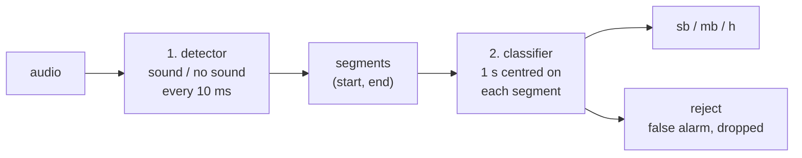

1. **Detector** ([`detector.py`](src/models/detector.py)): log-Mel spectrogram, three convolution blocks that pool the frequency axis only, a bidirectional GRU, one logit per 10 ms frame. Overlapping 1 s windows are averaged, thresholded, glued across short gaps, cut at deep dips of the score and filtered by minimum duration ([`localization.py`](src/localization.py)). Those four post-processing values are chosen on the validation set.
2. **Classifier**: ResNet-50 (ImageNet weights) on the log-Mel spectrogram of a 1 s segment centred on the sound, four classes `h`, `mb`, `sb` and `reject`. HuBERT is also available, see below. A small CNN is kept in the code but is not part of the benchmark.
3. **Scoring** ([`pipeline.py`](src/pipeline.py)): a predicted event matches an annotated one when their intersection over union (IoU) is high enough; precision, recall and F1 follow, per type and overall.

### Detector architecture

One 1 s window in, one logit per 10 ms frame out (about 706 000 parameters). Time is never pooled, so the 101 frames stay aligned with the output.

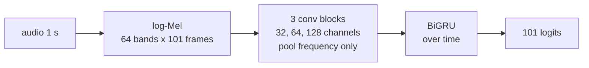

### Prediction flow

What `main.py predict` runs.

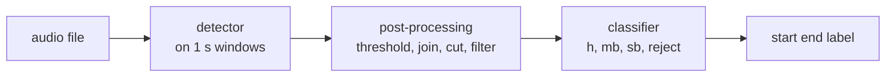

### Training and scoring flow

The three commands of the [Usage](#usage) section, in order.

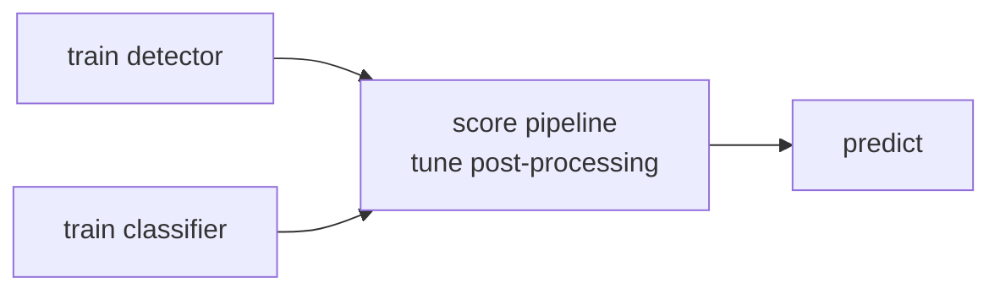

### Choices behind the data

Code in [`windows.py`](src/windows.py) and [`dataset.py`](src/dataset.py):

- Recordings are cut into **1 s windows with a 0.5 s hop**, labelled multi-hot.
- Audio is brought to 16 kHz and divided, per recording, by the **median RMS of its windows**, so recordings of different levels compare.
- The split is **in time**, not random: blocks of 60 s follow a cycle of 7 train, 2 validation and 1 test, with a 1 s margin between train and the others. Result on both recordings: 3400 train, 952 validation and 595 test windows.

## Install

Python 3.13 or later and [uv](https://docs.astral.sh/uv/).

```bash
uv sync
```

A GPU is used when available. HuBERT and ResNet-50 download their pretrained weights on first use.

## Data

One directory holding `{name}.wav` paired with `{name}.txt`. Each line of the text file is `start end label`, in seconds:

```
1.665 1.745 b
2.545 3.205 h
```

The data is not in the repository (`*.wav` is git-ignored). The two recordings used here are `23M74M` (300 s, 48 kHz) and `AS_1` (2212 s, 16 kHz). The annotation files are never modified: label variants are normalised on reading, and events ending after the audio are dropped ([`utils.py`](src/utils.py)).

## Configuration

Every global parameter lives in [`config.yaml`](config.yaml), read by [`src/config.py`](src/config.py): the window length and hop, the audio rate, the time split, the log-Mel settings, the epochs, batch size, learning rates, threshold and seed, the size of each model, the grids of the post-processing, and the weights directory. The file is commented; a key you leave out keeps its default, a key that does not exist is an error, and so is a value of the wrong type.

```yaml
windows:
  size: 1.0          # window length, in seconds
  hop: 0.5
training:
  epochs: 15
  seed: null         # an integer repeats a run, null leaves it random
models:
  learning_rates: {hubert: 2.0e-5, resnet50: 1.0e-4, cnn: 1.0e-3, detector: 1.0e-3}
```

The file is read when the program starts, so edit it before running `main.py`. To keep several settings side by side, point to another file:

```bash
BOWEL_CONFIG=my_config.yaml uv run python main.py train detect --data-dir DATA --test
```

Weights are only valid for the windows, Mel and model values they were trained with: change one of them and train again. The labels (`sb`, `mb`, `h`, `n`, `v`) are not parameters; they are part of the code. `--weights-dir` on the command line overrides `paths.weights_dir`.

## Scripts

| Script | Purpose |
|---|---|
| [`scripts/explore.py`](scripts/explore.py) | statistics of the recordings and annotations, anomalies, figures in `docs/` |
| [`scripts/preview_mel.py`](scripts/preview_mel.py) | log-Mel images with their labels |

## Results

All numbers are on the **test** blocks (about 10% of the audio), from one training run of each model, without a seed. The test cells were read by scoring the saved weights of those runs with the commands of [Usage](#usage); the validation figures further down come from the training runs themselves. A run with another seed or configuration gives other numbers, so read the tables as indicative: differences of a point or two between models are within the noise, and `h` has only 18 test events.

**Detector** (`train detect`): F1 and AUC of the sound frames.

| Model | F1 | AUC |
|---|---|---|
| detector | 0.86 | 0.976 |

**Classifier on true segments** (`train segments`): macro F1 and F1 per class.

| Model | Macro F1 | `h` | `mb` | `sb` | `reject` |
|---|---|---|---|---|---|
| resnet50 | **0.87** | 0.82 | 0.84 | 0.86 | 0.95 |
| hubert | 0.77 | 0.76 | 0.70 | 0.68 | 0.92 |

**Windows baseline** (`train windows`): which labels are in each 1 s window, no localisation. The validation columns are read from the figures below (the F1 from the curve, so about); the test column is the macro F1 of the five labels.

| Model | Best validation macro F1 | Validation macro AUC | Test macro F1 |
|---|---|---|---|
| resnet50 | about 0.82 (epoch 31) | 0.945 | **0.82** |
| hubert | about 0.81 (epoch 30) | 0.942 | 0.79 |

Validation AUC of each label, from the ROC curves:

| Model | `h` | `mb` | `n` | `sb` | `v` |
|---|---|---|---|---|---|
| resnet50 | 0.96 | 0.96 | 0.94 | 0.90 | 0.96 |
| hubert | 0.97 | 0.96 | 0.92 | 0.90 | 0.97 |

**Whole pipeline** (`pipeline`): event F1 with the detector and each classifier.

| Classifier | Detection F1, IoU ≥ 0.5 | Typed F1, IoU ≥ 0.5 | Detection F1, IoU ≥ 0.3 | Typed F1, IoU ≥ 0.3 |
|---|---|---|---|---|
| resnet50 | 0.68 | **0.60** | 0.76 | **0.66** |
| hubert | 0.68 | 0.51 | 0.76 | 0.59 |

The detection columns are the same for both rows: the detector and its post-processing do not depend on the classifier. The typed columns also require the right type. At IoU ≥ 0.5 the typed F1 per type is, for ResNet-50, `sb` 0.64, `mb` 0.58, `h` 0.44, and for HuBERT `h` 0.53, `sb` 0.52, `mb` 0.50 (`h` has only 18 test events).

### Training curves

Loss and validation F1 of each epoch; the dotted line marks the epoch whose weights were kept. Figures made with `--display`, stored in [`docs/`](docs/).

**Detector**

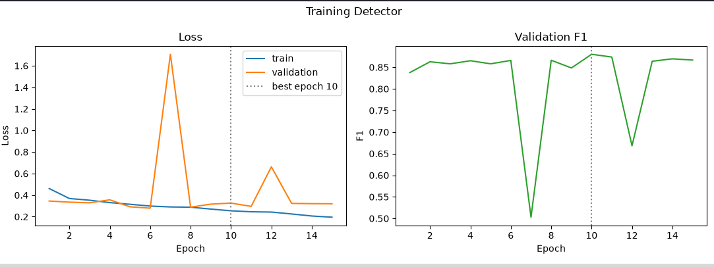

**HuBERT** (segment classifier)

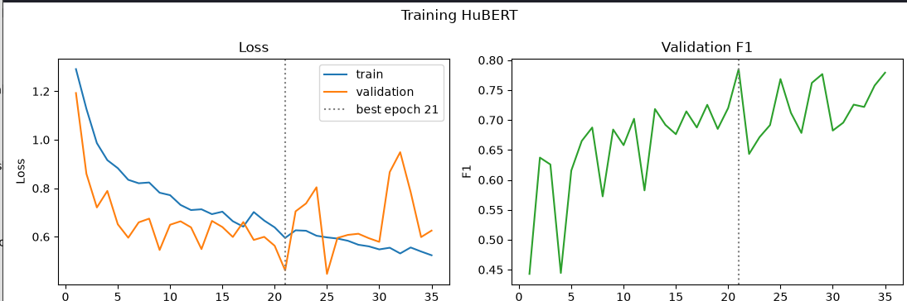

**ResNet-50** (segment classifier)

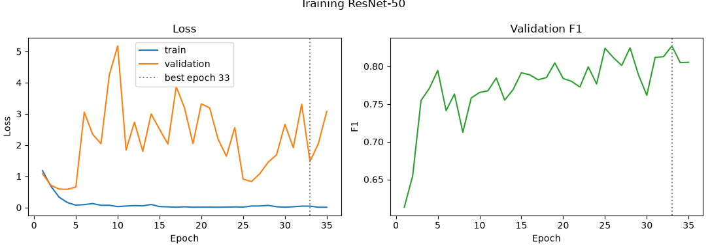

The validation loss is very irregular from one epoch to the next, so the best epoch is chosen on the F1 and not on the loss. The ResNet-50 train loss falls to nearly zero while its validation loss stays high and spiky, a sign of overfitting.

**HuBERT, windows task**

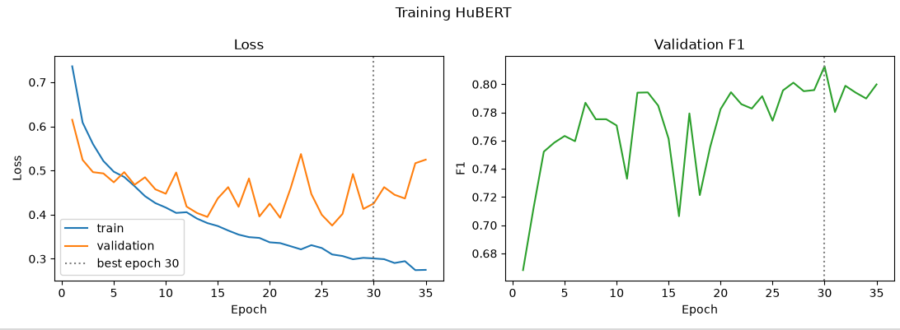

**ResNet-50, windows task**

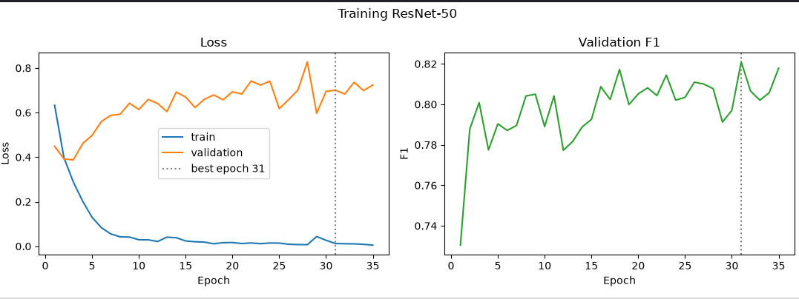

On windows the validation F1 climbs slowly to about 0.8 for both models. The ResNet-50 validation loss is lowest at epoch 3 and rises afterwards while its train loss keeps falling, so it overfits early; the F1 still improves a little until the epoch kept.

### Confusion matrices

**Segment classifiers** on the validation set (`evaluate segments --val`): rows are the true class, columns the predicted one.

| HuBERT | ResNet-50 |
|---|---|
| 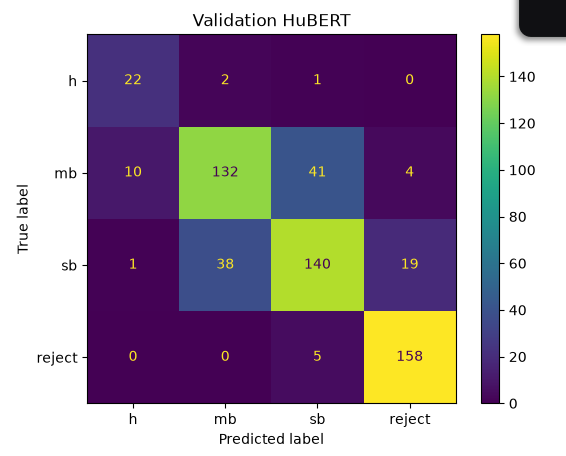 | 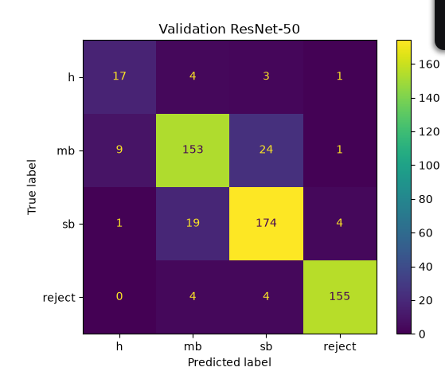 |

Most errors are between `mb` and `sb`, in both directions: an `mb` is a burst of several `sb`. From the counts, ResNet-50 gets 499 of the 573 validation segments right (87%) and HuBERT 452 (79%).

**Windows task** on the validation set (`evaluate windows --val --display`): the matrix has the five labels and `none`. A window can hold several labels, so it is read this way: a label found is on the diagonal; a label missed while another one is predicted in the same window goes to the cell (missed, predicted); a miss with nothing predicted goes to (label, `none`); a false alarm on a window with no label goes to (`none`, label). The percentage is the share of the row.

| HuBERT | ResNet-50 |
|---|---|
| 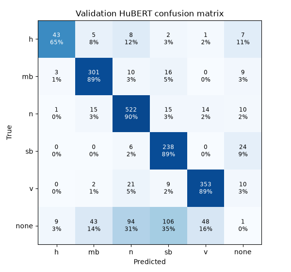 | 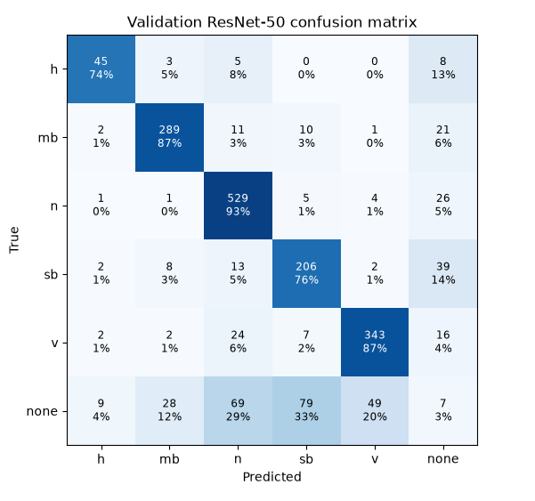 |

The diagonal holds 65% to 90% of each row for HuBERT and 74% to 93% for ResNet-50. ResNet-50 is better on `h` (74% against 65%) and `n` (93% against 90%), HuBERT on `sb` (89% against 76%); ResNet-50 misses more `sb` windows outright (14% against 9%). In both, the false alarms of the `none` row land mostly on `sb` and `n`.

### ROC curves

One curve per label of the windows task, one against the rest, on the validation set.

| HuBERT | ResNet-50 |
|---|---|
| 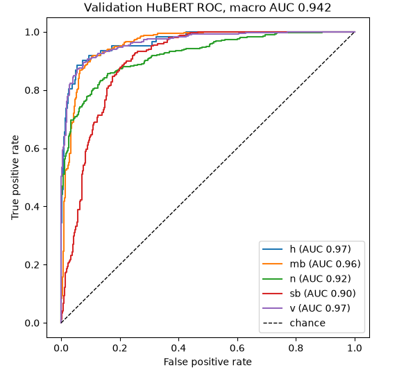 | 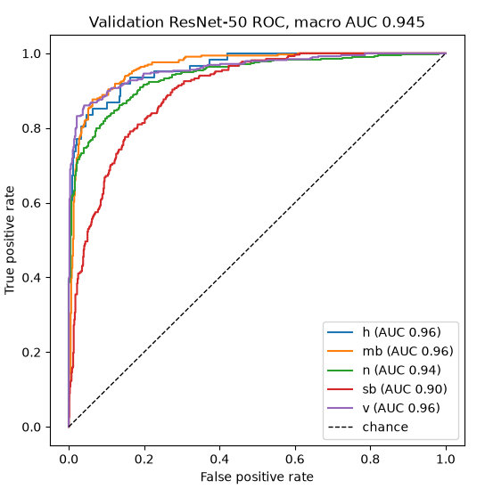 |

The macro AUC is the same for both models (0.945 and 0.942). `sb` is the hardest label for both (AUC 0.90), probably because a short single burst is hard to tell from the background. `h`, `mb` and `v` are at 0.96 to 0.97.

## Limits

- **Two recordings only.** The test blocks come from the same recordings as the training blocks, so the scores say nothing about a new patient, a new microphone or a new room.
- **Small test set**: few events per type, and `h` is the rarest. Its figures are unreliable.
- **One run, no seed by default**: unless `training.seed` is set, differences of a point or two between runs are within the noise.
- **Close sounds**: the detector tends to glue sounds that are a few tens of milliseconds apart into one segment, which lowers the IoU.
- A proof of concept: it is not validated for clinical use.
